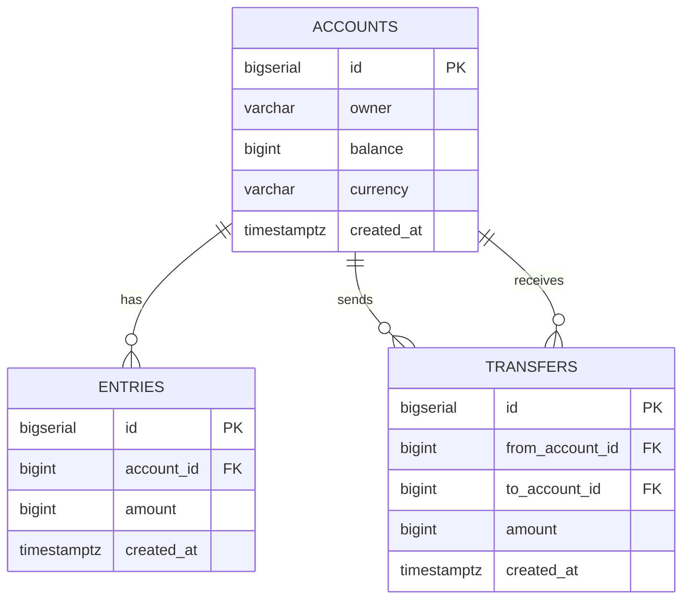

# Core 🏦

**Core** is a robust, high-performance banking ledger service written in **Go**.
It simulates a backend banking system with support for creating accounts, tracking balance changes, and executing money transfers securely.

The project emphasizes:

* **Data Consistency**
* **ACID Transactions**
* **Concurrency Handling** (Deadlock prevention)

All implemented using **pure SQL** and **idiomatic Go patterns**.


---

## 🏗 Architecture & Design

The project follows **Clean Architecture**, clearly separating concerns between:

* **API layer**
* **Business / Store logic**
* **Database access**

### Key Features

* **RESTful API**
  Built with [Gin](https://github.com/gin-gonic/gin) for high performance and minimal boilerplate.

* **Database**
  PostgreSQL as the relational database engine.

* **Type-Safe SQL**
  Uses [sqlc](https://github.com/sqlc-dev/sqlc) to generate Go code from raw SQL.
  Ensures compile-time safety and zero runtime reflection.

* **ACID Transactions**
  Money transfers are executed inside database transactions (`BEGIN`, `COMMIT`, `ROLLBACK`) to guarantee consistency.

* **Deadlock Prevention**
  Consistent row-locking order based on account IDs.
  Safe under high concurrency.

* **Dockerized**
  Fully containerized app and database.
  No local Go or PostgreSQL installation required.

* **Testing**
  Comprehensive unit tests for:

  * CRUD operations
  * Concurrent transfer scenarios
  * Deadlock prevention (TDD approach)

---

## 🗄 Database Schema



---

## 🛠 Tech Stack

* **Language:** Go (Golang)
* **Database:** PostgreSQL
* **Web Framework:** Gin Gonic
* **ORM / DAO:** sqlc (pure SQL, no reflection)
* **Migrations:** golang-migrate
* **Infrastructure:** Docker & Docker Compose
* **Testing:** Testify

---

## 🚀 Getting Started

> You don’t need to install Go or PostgreSQL locally.
> Just make sure **Docker** and **Make** are installed.

### 1️⃣ Clone the Repository

```bash
git clone https://github.com/dotenv213/core.git
cd titan-core
```

### 2️⃣ Start PostgreSQL

```bash
make postgres
```

### 3️⃣ Create & Migrate Database

```bash
make createdb
make migrateup
```

### 4️⃣ Run Tests

Runs all unit tests, including concurrent deadlock tests:

```bash
make test
```

### 5️⃣ Run the Server

```bash
go run cmd/ledger/main.go
```

The server will start on:

```
http://0.0.0.0:8080
```

---

## 📂 Project Structure

```bash
.
├── cmd/                 # Application entry points
│   └── ledger/
│       └── main.go
├── internal/
│   ├── api/             # HTTP handlers & routing (Gin)
│   └── data/
│       └── db/          # sqlc generated code & transaction store
├── db/
│   ├── migration/       # Database migration files (.sql)
│   └── query/           # Raw SQL queries for sqlc
├── Makefile             # Automation commands
└── sqlc.yaml            # sqlc configuration
```

---

## 🧪 Engineering Highlights

### 🔒 Deadlock Prevention Strategy

In concurrent transfer scenarios (e.g. A → B and B → A), deadlocks are prevented by enforcing a **strict locking order**.

Accounts are always locked in ascending ID order:

```go
if arg.FromAccountID < arg.ToAccountID {
    // Lock smaller ID first
    result.FromAccount, result.ToAccount, err =
        addMoney(ctx, arg.FromAccountID, -arg.Amount, arg.ToAccountID, arg.Amount)
} else {
    // Lock smaller ID first (ToAccount in this case)
    result.ToAccount, result.FromAccount, err =
        addMoney(ctx, arg.ToAccountID, arg.Amount, arg.FromAccountID, -arg.Amount)
}
```

This guarantees:

* No circular waits
* Safe execution under high concurrency
* Deterministic transaction behavior

---

## 📜 Makefile Commands Reference

| Command            | Description                       |
| ------------------ | --------------------------------- |
| `make postgres`    | Start PostgreSQL container        |
| `make createdb`    | Create the `simple_bank` database |
| `make migrateup`   | Apply all up migrations           |
| `make migratedown` | Revert the last migration         |
| `make sqlc`        | Generate Go code from SQL queries |
| `make test`        | Run all unit tests                |

---

## ✅ Summary

This project demonstrates:

* Real-world **banking ledger design**
* Correct **transaction handling**
* **Concurrency-safe** money transfers
* Clean, testable, production-grade Go code

Perfect as:

* A backend systems showcase
* A learning resource for SQL + Go concurrency
* A foundation for a real banking or fintech service
